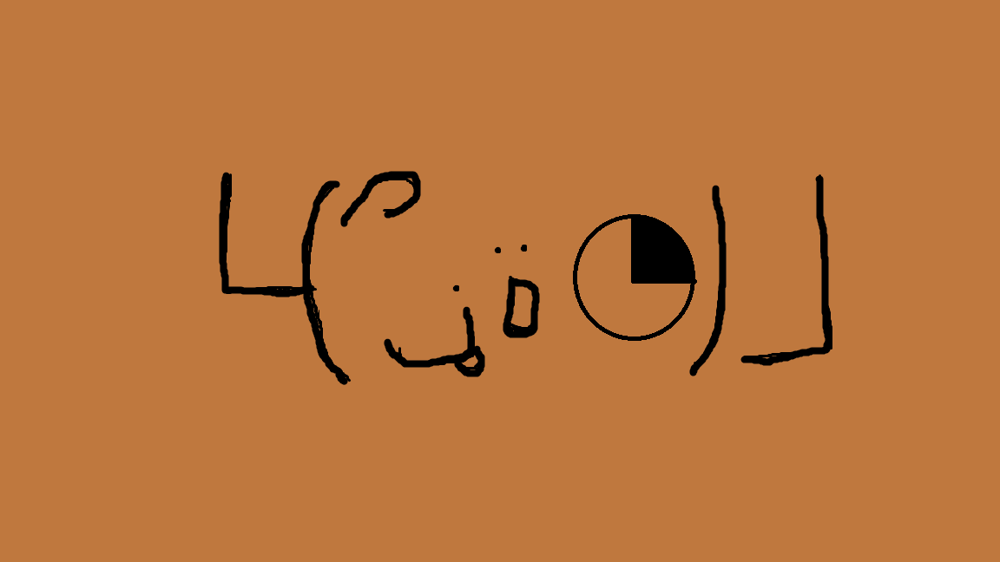

<a class="twitter-timeline" data-width="400" data-height="600" href="https://twitter.com/NEO_V_Obs?ref_src=twsrc%5Etfw">Tweets by NEO_V_Obs</a> 

<iframe src="https://openprocessing.org/sketch/1174070/embed/" width="400" height="400"></iframe>

# About

Ne0（ねお）と申します。

一般知的好奇心に従う系クリエイターの卵以下（編集時点）兼Vの観測者兼ゲームエンジョイ勢。

HTML・CSS・JavaScriptで作ったWebサイトの制作と公開、Unityでゲーム制作、Blenderの3Dモデリングなど色々やってます。（ほとんど簡単なのばっか）

Web開発やVR・ARといった領域に興味がありますが、基本面白そうなら大体何でもやります。（ITでもそうでなくても）

趣味…ゲーム、プログラミング、音楽鑑賞（HARDCOREなどキック強めな曲、Vtuber楽曲）

## Profile
- 名前:Ne0
- いるところ:仮想空間
- 得意なこと:寝ること食うこと遊ぶこと、そして諦めないこと。後、Webサイト作成、ゲーム企画発案、シナリオ作成

# Skills
- OS…Windows,Linux(Ubuntu)
- Languages…HTML,CSS,JavaScript,C,Python
- Engine,Frameworks…Node.js
- Tool,MiddleWare…Git
- 資格、免許…第二種電気工事士

# Works
- [GitHub](https://github.com/Ne0-N-line)
- 作った作品
  - [作品1:あなたのいいところ診断](https://ne0-n-line.github.io/assessment/assessment.html)

# Contact
- [Twitter](https://twitter.com/NEO_V_Obs)

